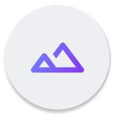
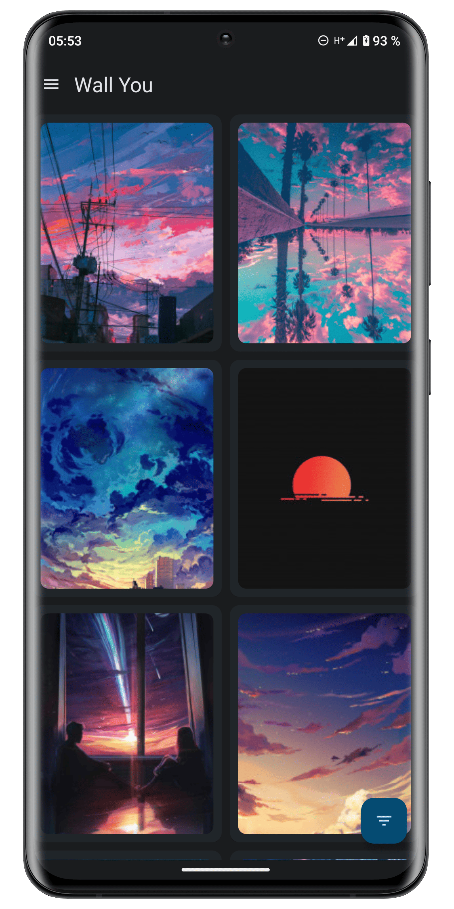
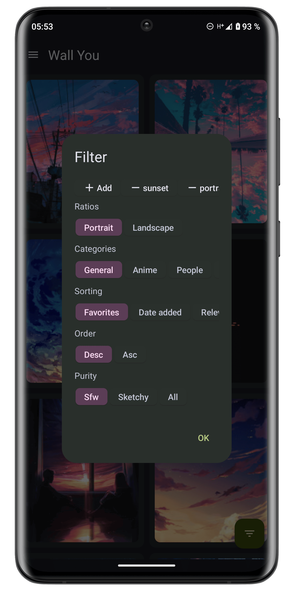
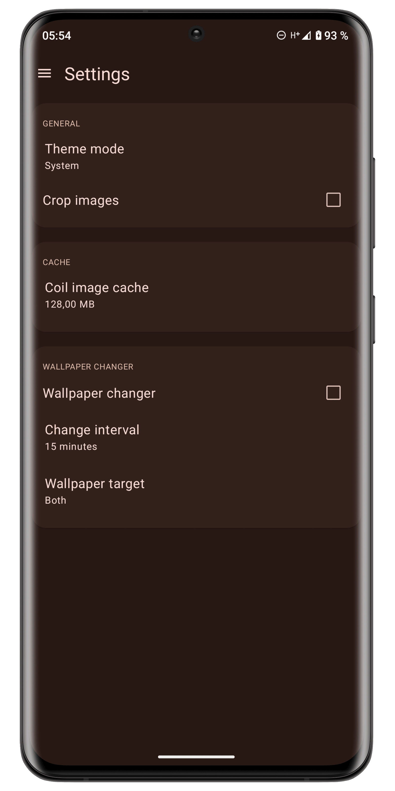
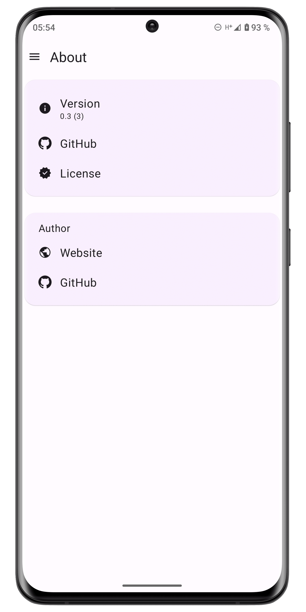

<!-- ---------- Header ---------- -->

  
  <h1>Wall You</h1>

Wallpaper App built with <a href="https://m3.material.io/">Material Design 3 (You)</a>

<!-- ---------- Badges ---------- -->
  

    
    
    
    
    
     

<!-- ---------- Description ---------- -->
## Features

- [x] Automatic Wallpaper Changer
- [x] Favorites
- [x] Search filters
- [x] Material Design 3 (You)
- [x] Written in Jetpack Compose
- [x] Entirely Open Source

<!-- ---------- Download ---------- -->
## Download
  

<!-- ---------- Screenshots ---------- -->
## Screenshots

  
  
  
  

<!-- ---------- Contribution ---------- -->
## Contribution

**All contributions are welcome!** \
If you are a developer and wish to contribute to the app, please **fork** the project and submit a [**pull request**](https://help.github.com/articles/about-pull-requests/).

## Translation

## License

Wall You is licensed under the [**GNU General Public License**](https://www.gnu.org/licenses/gpl.html): You can use, study and share it as you want.
